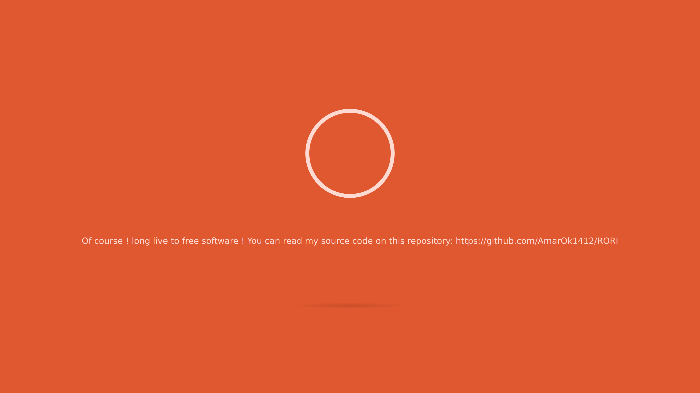

# RORI: Linux client

This is the linux client for [RORI](http://github.com/AmarOk1412/RORI)

To have more informations on what is RORI, please see the [wiki](https://github.com/AmarOk1412/rori_core/wiki). But in short RORI is a modulable open-source chatterbot platform. The first version was written in 2011 (2.0 in September 2012). I rewrote it in Rust in 2017, and I'm currently migrating the whole communication to use [GNU Ring](https://ring.cx).

# Why RORI?

I run a lot of chatterbots on multiple services (IRC, Discord, Websites, my computer). Some bots do the exact same thing but run on a different service. The idea is to avoid to rewrite the core of each chatterbot and use the same base. Now, I just have to write an interface to communicate with this core on each services.

This is some examples of what I will do with **RORI** (as soon as the migration is finished):
+ Ask **RORI** to launch music on the *best* device (on my computer, or stream on a discord server for example).
+ Ask **RORI** to be alarmed at 7:40.
+ Ask **RORI** to send messages to a friend.
+ Ask **RORI** to shutdown a device.
+ Send a picture to **RORI** and ask to store this pict in the *best* folder.
+ Ask **RORI** to send me a notification before a rendez-vous.

# Install

First, you will need [mimic](https://github.com/MycroftAI/mimic) for the TTS capability (read install instructions or run `make dep`, this will install mimic and SpeechRecognition).

Then, `make build` to compile the client and `make run` to execute it.

# Speech to text

For now, the client uses a Python module to perform speech recognition: Speech Recognition (see `scripts/stt.py`). It's a separate script which interact with the client via an API. This will be replaced when DeepSpeech will be good. To directly run the client with the Speech Recognition enabled, just run `make run_with_stt`.

## Contribute

Please, feel free to contribute to this project in submitting patches, corrections, opening issues, etc.

If you don't know what you can do, you can look the [good-first-issue](https://github.com/AmarOk1412/rori_linux_client/issues?q=is%3Aissue+is%3Aopen+label%3A%22good+first+issue%22) label, or still creates modules.

For more infos and ideas read [CONTRIBUTING.md](/CONTRIBUTING.md) (this file doesn't exists for now) and [CODE_OF_CONDUCT.md](/CODE_OF_CONDUCT.md).
